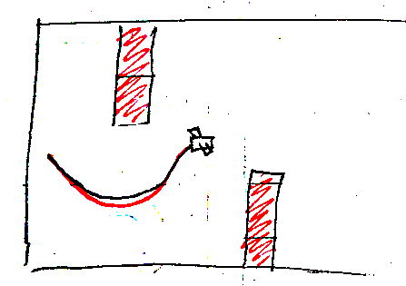
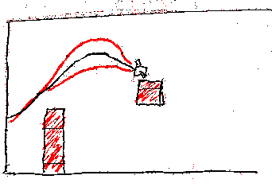
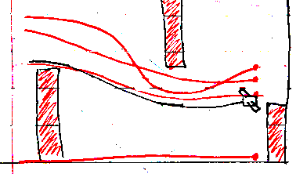

# Democratic Fighter Pilot
#### - an overly collaborative web game

When a user connects, the game begins as an uglier verson of Flappy Bird. The trajectory (y-axis) of the plane is controlled using a knob. Life is easy. Perhaps too easy?

Another player joins, and as democracy is the name of the game, that player also gets a vote. The average of the two votes controls the trajectory of the plane. As long as eveyone is aligned, democracy reigns supreme...

But what happens more voters join in?

    
### Progress

| Session # | Focus                                               | Time           |
| :------:  | ---------------------------------------             | ----------     |
| 1         | Get a Flask app with pure websockets up and running | 45 min (45) |
| 2         | Enable debugging and reload in app                  | ?? (30)        |
| 3         | Probagate state from client to screen               | 45 min (44) |
| 4         | State from knob to screen                           | 10 min (19) |

### References
* [flask-sockets](https://github.com/kennethreitz/flask-sockets) - websockets for Flask
* [ws](https://github.com/hashrocket/ws) - simple cli for websockets 
* 