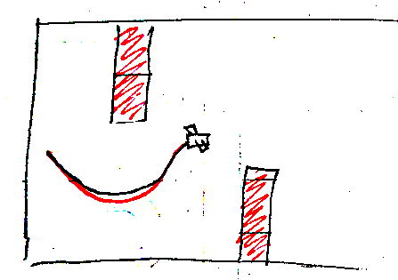
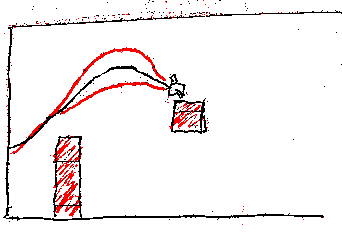
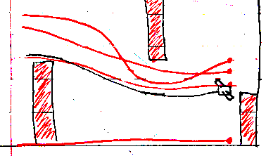

# Democratic Fighter Pilot
#### - an overly collaborative web game

When a user connects, the game begins as an uglier verson of Flappy Bird. The trajectory (y-axis) of the plane is controlled using a knob. Life is easy. Perhaps too easy?

Another player joins, and as democracy is the name of the game, that player also gets a vote. The average of the two votes controls the trajectory of the plane. As long as eveyone is aligned, democracy reigns supreme...

But what happens more voters join in?

